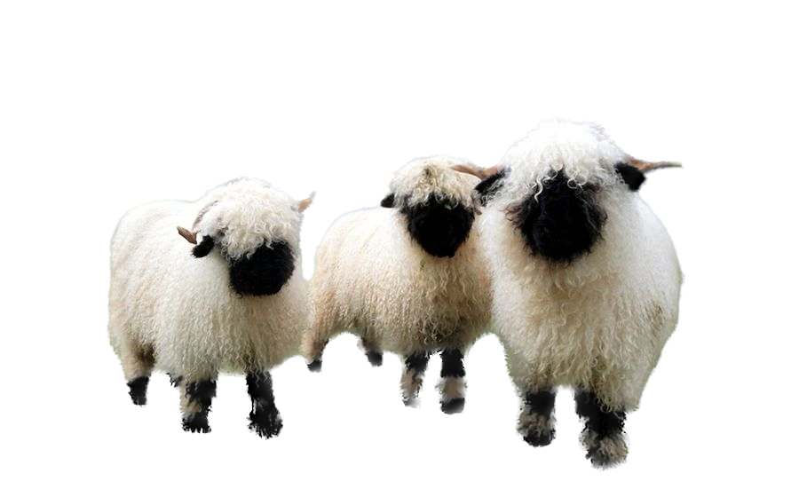

# Sheep 🐑

## The Symbolism of Sheep

Sheep have long held symbolic significance across cultures. Representing qualities such as innocence, humility, and community, they remind us of the deeper connections we share with the natural world.

## Unity in Grazing

### Guardians of the Countryside

#### Fascinating Tidbit

Sheep possess a unique ability to recognize faces, both human and ovine. Their social intelligence enhances their interactions and strengthens their bonds.

